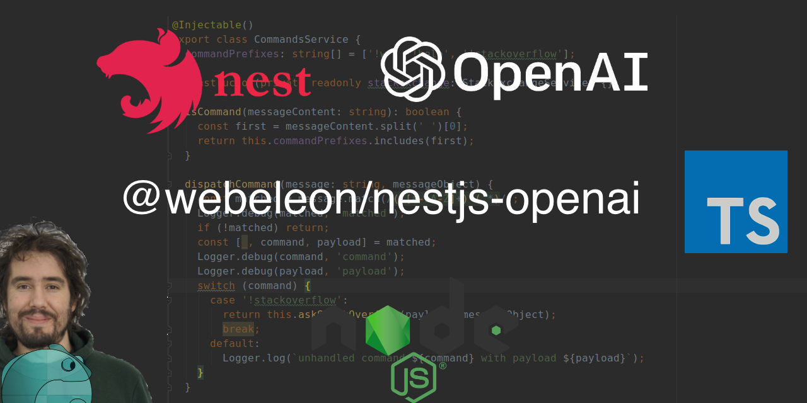

[](https://coveralls.io/github/Webeleon/nestjs-openai?branch=main)
[](https://badge.fury.io/js/%40webeleon%2Fnestjs-openai)

## Installation

```bash
$ npm install @webeleon/nestjs-openai
```

## Usage

In the root module

```ts
import { OpenAiModule, Models } from "@webeleon/nestjs-openai";

@Module({
  imports: [
    OpenAiModule.forRoot({
      apiKey: 'YOUR_OPEN_AI_API_KEY',
      model: Models.GPT4
    })
  ],
})
class AppModule {}
```

## Useful links

[API DOC](https://webeleon.github.io/nestjs-openai/)
[julien@webeleon](https://www.linkedin.com/in/julien-prugne/)


